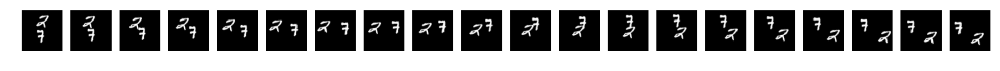
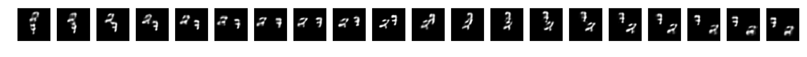
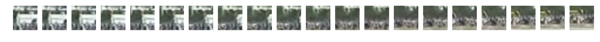
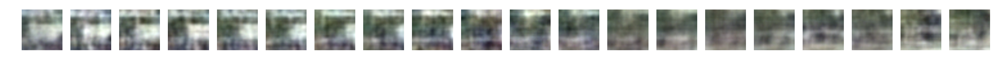

## Unsupervised Learning of Video Representations using LSTMs

Code for paper [Unsupervised Learning of Video Representations using LSTMs](http://arxiv.org/abs/1502.04681) by Nitish Srivastava, Elman Mansimov, Ruslan Salakhutdinov; ICML 2015.

We use multilayer Long Short Term Memory (LSTM) networks to learn representations of video sequences. The representation can be used to perform different tasks, such as reconstructing the input sequence, predicting the future sequence, or for classification. Example:


Note that the code at [this link](http://www.cs.toronto.edu/~nitish/unsupervised_video/) is deprecated.

### Getting Started

To compile cudamat library you need to modify `CUDA_ROOT` in `cudamat/Makefile` to the relevant cuda root path.

The libraries you need to install are:

* h5py
* google.protobuf
* numpy
* matplotlib

Next compile .proto file by calling

```
protoc -I=./ --python_out=./ config.proto
```

You will also need to download the dataset files. These can be obtained by running

```
wget http://www.cs.toronto.edu/~emansim/datasets/mnist.h5
wget http://www.cs.toronto.edu/~emansim/datasets/bouncing_mnist_test.npy
wget http://www.cs.toronto.edu/~emansim/datasets/ucf101_sample_train_patches.npy
wget http://www.cs.toronto.edu/~emansim/datasets/ucf101_sample_valid_patches.npy
```

**Note to Toronto users:** You don't need to download any files, as they are available in my gobi3 repository and are already set up.

### Bouncing (Moving) MNIST dataset

To train a sample model on this dataset you need to set correct `data_file` in `datasets/bouncing_mnist_valid.pbtxt` and then run (you may need to change the board id of gpu): 

```
python lstm_combo.py models/lstm_combo_1layer_mnist.pbtxt datasets/bouncing_mnist.pbtxt datasets/bouncing_mnist_valid.pbtxt 1
```

After training the model and after setting correct path to weights in `models/lstm_combo_1layer_mnist_pretrained.pbtxt`, to visualize the sample reconstruction and future prediction results of the pretrained model run

```
python display_results.py models/lstm_combo_1layer_mnist_pretrained.pbtxt datasets/bouncing_mnist_valid.pbtxt 1
```

Below are the sample results, where first image is reference image and second image is model prediction. Note that first ten frames are reconstructions, whereas the last ten frames are future predictions.





### Video patches

Due to the size constraints, I only managed to upload a small sample dataset of UCF-101 patches. The trained model is overfitting, so this example is just meant for instructional purposes. The setup is the same as in Bouncing MNIST dataset.

To train run:

```
python lstm_combo.py models/lstm_combo_1layer_ucf101_patches.pbtxt datasets/ucf101_patches.pbtxt datasets/ucf101_patches_valid.pbtxt 1
```

To see results run:

```
python display_results.py models/lstm_combo_1layer_ucf101_pretrained.pbtxt datasets/ucf101_patches_valid.pbtxt 1
```




### Classification using high level representations ('percepts') of video frames

Again, as in the case of UCF-101 patches, I was able to upload a very small subset of fc6 features of video frames extracted using VGG network. To train the classifier run:

```
python lstm_classifier.py models/lstm_classifier_1layer_ucf101_features.pbtxt datasets/ucf101_features.pbtxt datasets/ucf101_features_valid.pbtxt 1
```

### Reference

If you found this code or our paper useful, please consider citing the following paper:

```
@inproceedings{srivastava15_unsup_video,
  author    = {Nitish Srivastava and Elman Mansimov and Ruslan Salakhutdinov},
  title     = {Unsupervised Learning of Video Representations using {LSTM}s},
  booktitle = {ICML},
  year      = {2015}
}
```